```{r setup, include=FALSE}
knitr::opts_chunk$set(echo = FALSE)
```
## Who am I?
::::::::::::::{.columns}
:::{.column}
- Landscape ecologist/GIS 
- Fake limnologist
- Fake R guy
- US EPA Research Ecologist since ~2006
- Worked on: Forests, wetlands, gopher tortoise, estuaries, lakes, cyanobacteria, ...
:::
:::{.column}
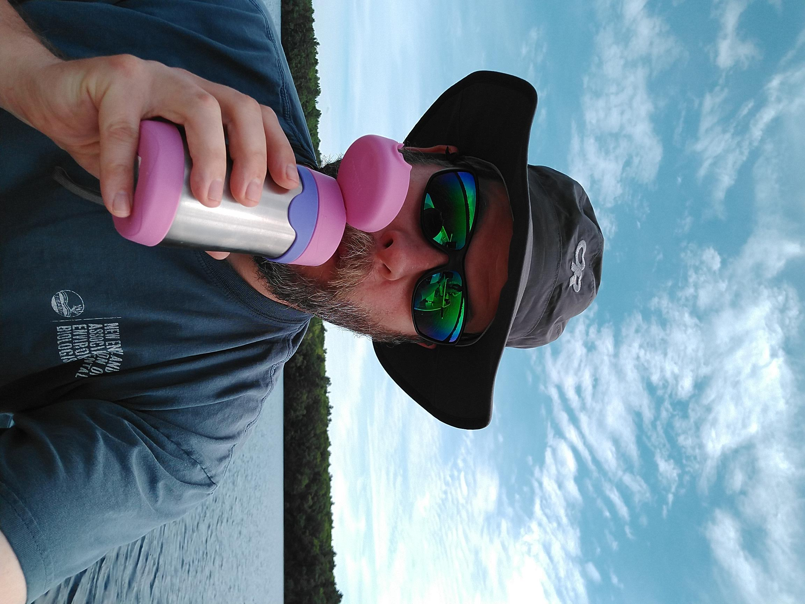
:::
::::::::::::::

## The rest of the cast
:::::::::::::: {.columns}
::: {.column}
#### Lakes and Computational Ecology
- Betty Kreakie
- Bryan Milstead
- Stephen Shivers
- Sophie Fournier
- Farnaz Nojavan (Alumnus: now a Data Scientist at FM Global) 
:::
::: {.column}
#### Administrative/Legal/IM
- Ann Vega
- Valerie Brandon
- Michelle Ibarra
- David Smith
- Scott Albright
- Geoff Cooper
- Ethan McMahon
- Andrew Yuen
:::
::::::::::::::

## The story

- Lakes and cyanobacteria
- Computational approaches
- Open data science tools 


## Two steps forward: R
:::::::::::::: {.columns}
::: {.column}
- In use for a long time
- Growth in users
  - ORD, Regions, Client Offices
- Installs originally *ad hoc*
:::
::: {.column}

:::
::::::::::::::
## One step back: R

- Tightly controlled and changing IT environment
- Install approvals onerous and inconsistent
- Often only partly-functional
- Much angst


## Progress: R

- Standardized installation
- Pre-approved
- Requests via email
- Still occasional problems...

:::::::::::::: {.columns}
::: {.column}

:::
:::{.column}

:::
::::::::::::::

## Two steps forward: GitHub

- GitHub for USEPA ~2013
- 167 repositories
- 623 members in the USEPA Org
- 177 members who have committed


## One step back: GitHub 

- No collaboration for you
- Priced out?
- No Admin rights


## Progress: GitHub

- Can now use a collaboration platform to collaborate!
- Pricing issue still a work in progress
  - Discussions about using multiple Orgs
  - Enterprise GitHub
  - Bitbucket...

## Two steps forward: Pre-prints and post-publication review

- [Hollister et al. (2016). Modelling lake trophic state: a random forest approach. Ecosphere](http://onlinelibrary.wiley.com/doi/10.1002/ecs2.1321/full)
    - Uses NLA 2007
    - Random forests to predict chlorophyll *a* based trophic state
    - After clearance, before peer-review published as a [PeerJ Preprint](http://dx.doi.org/10.7287/peerj.preprints.1319v2)

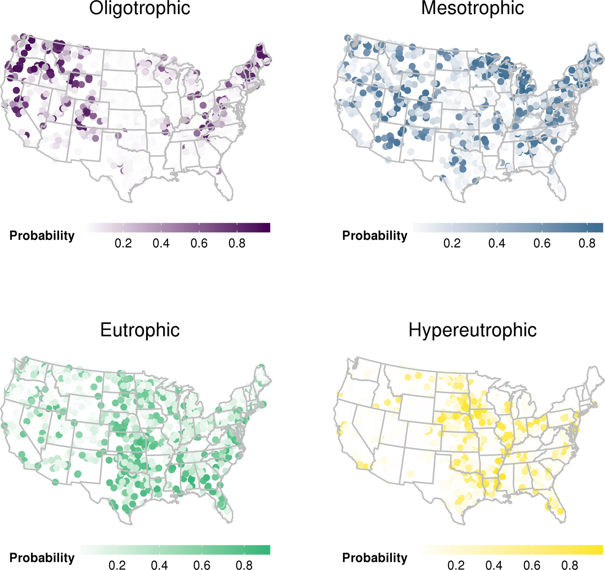    

## Two steps forward: Pre-prints and post-publication review

- [Hollister and Kreakie. (2016). Associations between Chlorophyll a and various Microcystin-LR Health Advisory Concentrations. F1000Research](https://dx.doi.org/10.12688/f1000research.7955.2)
    - Uses NLA 2007
    - Empirical method to answer, "What is a bloom?"
    - Published at F1000Research immediately after clearance

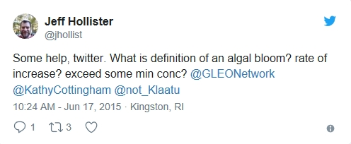

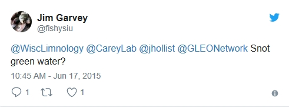

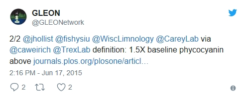

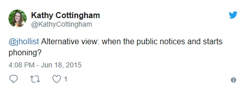

## One step back: Pre-prints and post-publication review

- Why would you do such a thing?
- Many emails
- And again, much angst

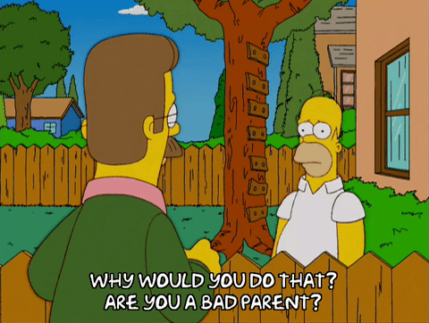

## Progress: Pre-prints and post-publication review

- Separate briefing lab senior managers on open science
- Pre-prints and post-publication tacitly allowed
- An interim policy 

## Two steps forward: Code review

::::::::::::::{.columns}
:::{.column}
- [`lakemorpho`: Lake morphometry metrics in R](https://cran.r-project.org/package=lakemorpho)
- `sp`, `rgdal`, `rgeos`, and `raster`
- `sf` support to be added
- [National Lake Morphometry](https://edg.epa.gov/metadata/catalog/search/resource/details.page?uuid=%7B495CBAED-9BB9-49B4-80A7-1C91DE5FCA95%7D)
- [NHD Plus](https://s3.amazonaws.com/nhdplus/NHDPlusV21/Documentation/NHDPlusV2_User_Guide.pdf#page=52)
- [Hollister and Milstead (2010)](http://dx.doi.org/10.1080/07438141.2010.504321)
- [Hollister *et. al.* (2011)](http://dx.doi.org/10.1371/journal.pone.0025764)
- [Hollister and Stachelek (2017)](https://f1000research.com/articles/6-1718/v1)
:::
:::{.column}
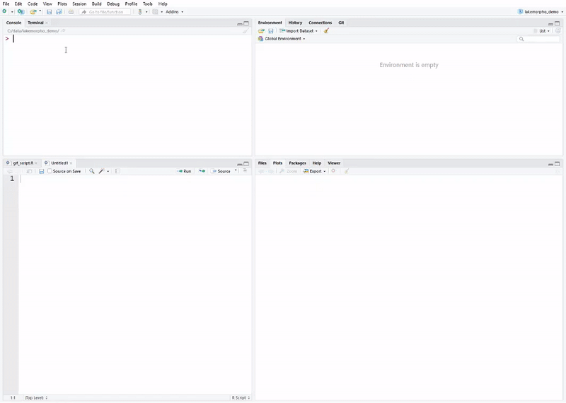
:::
::::::::::::::

## Two steps forward: Code review

::::::::::::::{.columns}
:::{.column}
- [`elevatr`:Access elevation data in R](https://cran.r-project.org/package=elevatr)
- Access elevation data in R
  - ~~Mapzen~~
      - closed!
  - AWS
  - USGS
- Built off of `sp`, `rgdal`, `rgeos`, and `raster` suite
- `sf` support to be added
- Development version has support for SRTM and `sf` objects
:::
:::{.column}
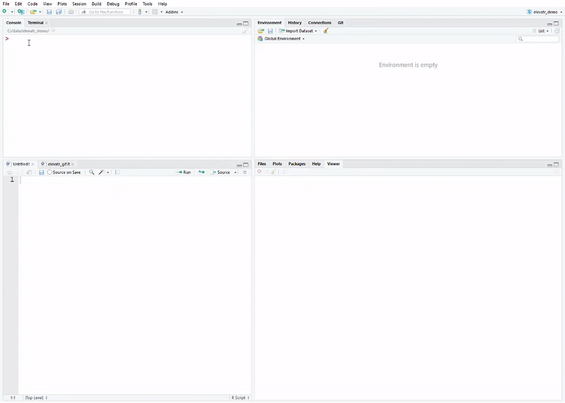
:::
::::::::::::::

## One step back: Code review

- First attempt failed (see One step back: GitHub)
- Lack of internal review mechanism for scientific software
- But got reviewed anyway


## Progress: Code review

- New GitHub collaborator policy
- Draft Scientific Software Clearance policy
- With EPA Office of Research and Development Senior Managers

## Two steps forward: Licensing

- Creative Commons Zero (CC0) Approved in 2015
- Federal Source Code Policy promised guidance


## One step back: Licensing

- Not quite there...
- CC0 isn't OSI approved
- Guidance never came
- Prevented use of Journal of Open Source Software 


## Progress:  Licensing

- As of early 2019, approval for MIT, GPL v3, LGPL-2.1, and Apache 2.0.
- Other licenses are under review

## Two steps forward: Shiny
::::::::::::::{.columns}
:::{.column}
- Everyone wants Shiny!
- Various internal servers and apps over the years
- ~20 applications on central server, many others elsewhere
- EPA building skills and demand for Shiny applications
- Have enterprise server
- Examples on cloud.gov
:::
:::{.column}


[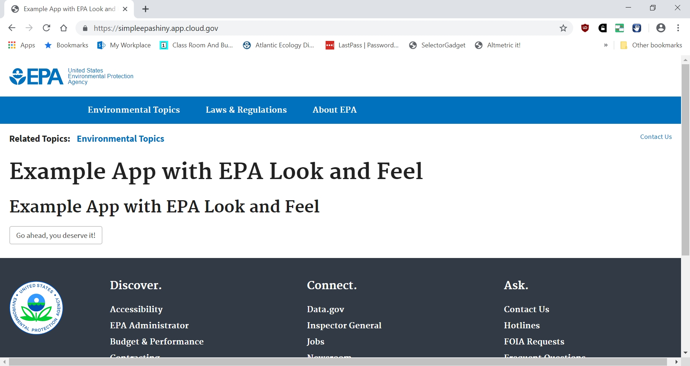](https://simpleepashiny.app.cloud.gov)
:::
::::::::::::::
## One step back: Shiny

- Made it through many "shining" doors, but never sure what is on the other side
- Enterprise Shiny Server progress measured in years
- Many technical hurdles with cloud.gov (i.e. don't be first)


## Progress: Shiny

- Tantalizingly close to first apps on shiny.epa.gov
- Making progress on other fronts for Shiny (e.g. EPA AWS Platform)

## Two Steps Forward: Bringing it all together

::::::::::::::{.columns}
:::{.column}
- Current project: Temporal and spatial dynamics of cyanobacteria in Rhode Island ponds
- Twice weekly sampling
- Three ponds in RI
- 7 stations per pond
- Chlorophyll, phycocyanin, nutrients, physical profiles, zoo- and phytoplankton
- Uses much of the open data science toolset
:::
:::{.column}
:::
::::::::::::::

## pics
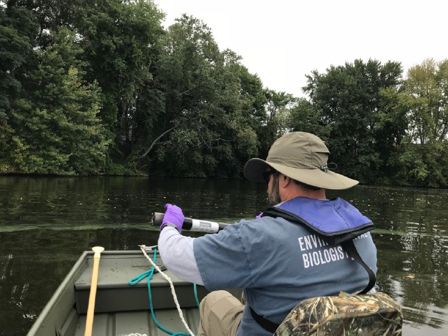

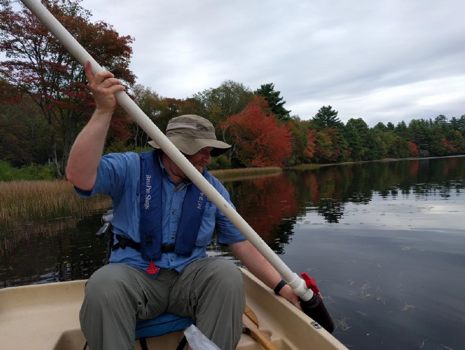

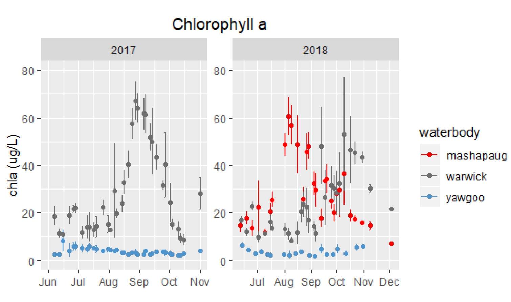

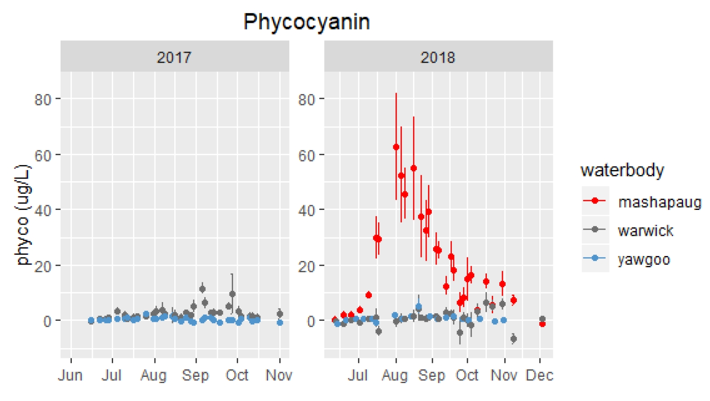


## One Step Back: Bringing it all together

- So far, so good!

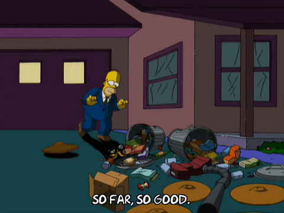

## Unorganized parting thoughts

- Future challenges
    - FLAMe and DIY buoys
    - Data collection from buoys anticipated as an issue
- This is a documentary, not a how-to
- Much of this progress required a bit of subversion

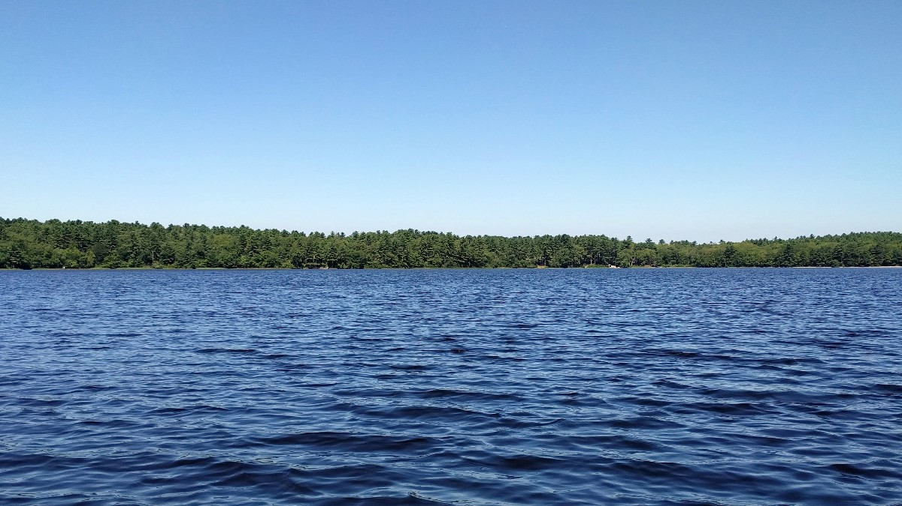