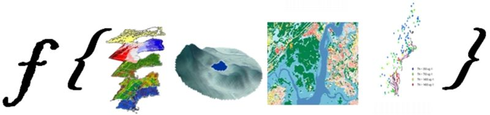

```{r setup, include=FALSE}
knitr::opts_chunk$set(echo = FALSE)
```
## Who am I?
::::::::::::::{.columns}
:::{.column}
- Landscape ecologist/GIS 
- Fake limnologist
- Fake R guy
- US EPA Research Ecologist since ~2006
- Worked on: Forests, wetlands, gopher tortoise, estuaries, lakes, cyanobacteria, ...
:::
:::{.column}

:::
::::::::::::::

## The rest of the cast
:::::::::::::: {.columns}
::: {.column}
#### Lakes and Computational Ecology
- Betty Kreakie
- Bryan Milstead
- Stephen Shivers
- Sophie Fournier
- Farnaz Nojavan (Alumnus: now a Data Scientist at FM Global) 
:::
::: {.column}
#### Administrative/Legal/IM
- Ann Vega
- Valerie Brandon
- Michelle Ibarra
- David Smith
- Scott Albright
- Geoff Cooper
- Ethan McMahon
- Andrew Yuen
:::
::::::::::::::

## The story

- Lakes and cyanobacteria
- Computational approaches
- Open data science tools 



## Two steps forward: R
:::::::::::::: {.columns}
::: {.column}
- In use for a long time
- Growth in users
  - ORD, Regions, Client Offices
- Installs originally *ad hoc*
:::
::: {.column}

:::
::::::::::::::
## One step back: R

- Tightly controlled and changing IT environment
- Install approvals onerous and inconsistent
- Often only partly-functional
- Much angst


## Progress: R

- Standardized installation
- Pre-approved
- Requests via email
- Still occasional problems...
:::::::::::::: {.columns}
::: {.column}

:::
:::{.column}

:::
::::::::::::::
## Two steps forward: GitHub

- GitHub for USEPA ~2013
- 167 repositories
- 623 members in the USEPA Org
- 177 members who have committed


## One step back: GitHub 

- No collaboration for you
- Priced out?
- No Admin rights


## Progress: GitHub

- Can now use a collaboration platform to collaborate!
- Pricing issue still a work in progress
  - Discussions about using multiple Orgs
  - Enterprise GitHub
  - Bitbucket...

## Two steps forward: Pre-prints and post-publication review

- [Hollister et al. (2016). Modelling lake trophic state: a random forest approach. Ecosphere](http://onlinelibrary.wiley.com/doi/10.1002/ecs2.1321/full)
    - Uses NLA 2007
    - Random forests to predict chlorophyll *a* based trophic state
    - After clearance, before peer-review published as a [PeerJ Preprint](http://dx.doi.org/10.7287/peerj.preprints.1319v2)

    

## Two steps forward: Pre-prints and post-publication review
::::::::::::::{.columns}
:::{.column}
- [Hollister and Kreakie. (2016). Associations between Chlorophyll a and various Microcystin-LR Health Advisory Concentrations. F1000Research](https://dx.doi.org/10.12688/f1000research.7955.2)
    - Uses NLA 2007
    - Empirical method to answer, "What is a bloom?"
    - Published at F1000Research immediately after clearance
:::
:::{.column}


:::
::::::::::::::
## One step back: Pre-prints and post-publication review

- General brain explosions...
- Many emails
- Much angst

## Progress: Pre-prints and post-publication review

- Separate briefing
- An interim policy resulted to allow our use of journals that use post-publication review

## Two steps forward: Code review

- `lakemorpho`
- `elevatr`

## One step back: Code review

- First attempt failed (see GitHub One step back)
- Lack of internal review mechanism
- Did review anyway, but no consistent mechanism

## Progress: Code review

- New GitHub collaborator policy
- Draft Scientific Software Clearance policy
- With ORD Senior Managers

## Two steps forward: Licensing

- Creative Commons Zero Approved in 2015
- Federal Source Code Policy promised guidance as well

## One step back: Licensing

- But...  CC0 isn't OSI approved
- Guidance never came
- Prevented use of Journal of Open Source Software 

## Progress:  Licensing

- As of ... we have approval to use MIT, GPL, Apache
- Other licenses are under review

## Two steps forward: Shiny

- Broad demand for Shiny applications
- Many Shiny developers across the Agency
- Got

## One step back: Shiny

- Multiple steps back but at different time and for different reasons
- Purchase of Enterprise Shiny server took forever
- Set up of server took forever
- Process to add and troubleshoot apps took forever (still a WIP)
- Just internal to EPA
- cloud.gov not a traditional server set up

## Progress: Shiny

- Very, very close to first ATO'd, official public EPA shiny app on shiny.epa.gov
- Making progress on other fronts for Shiny (e.g. EPA AWS Platform)

## Two Steps Forward: Bringing it all together

- Current project: Temporal and spatial dynamics of cyanobacteria in Rhode Island ponds
- Combining much of what we have done to date
- Several collaborators
- Data on GitHub
- Code in R

## One Step Back: Bringing it all together

- So far, so good!

## Future challenges

- FLAMe and DIY buoys
## Unorganized parting thoughts

- This is a documentary, not a how-to
- Much of this progress required a bit of subversion (doing things we weren't supposed to do)

